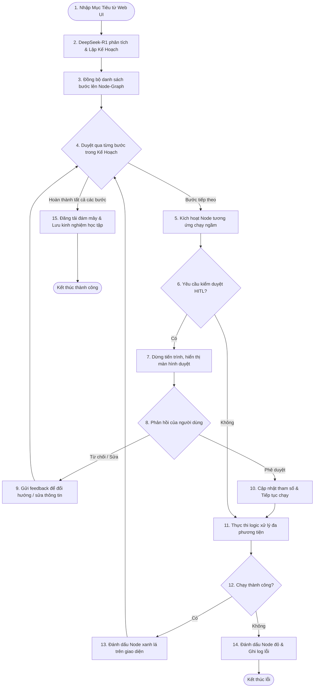

# ✦ AEGIS AI EMPLOYEE SYSTEM ✦
### Trung Tâm Điều Hành Tác Nhân Tự Động Hóa & Đa Phương Tiện (Advanced AI Employee Workflow Center)

Hệ thống **Aegis AI Employee** là một tác nhân AI (AI Agent) tự động hóa toàn trình, tích hợp sơ đồ node-graph trực quan giúp người dùng dễ dàng kết nối, kéo thả và tùy biến các khối chức năng để điều khiển toàn bộ pipeline xử lý đa phương tiện. Hệ thống có khả năng tự nhận thức mục tiêu, lập kế hoạch chi tiết, tương tác trực tuyến qua trình duyệt tự động, và tự rút bài học kinh nghiệm sau mỗi chu trình vận hành.

Dự án được thiết kế tối ưu để tận dụng tối đa sức mạnh phần cứng GPU (khuyên dùng các dòng card chuyên dụng như **NVIDIA RTX Quadro 6000 24GB VRAM** hoặc tương đương) để chạy cục bộ các mô hình ngôn ngữ lớn (DeepSeek-R1 qua Ollama) và mô hình nhận diện giọng nói tốc độ cao (`faster-whisper` trên nền CUDA).

---

## 🔄 Sơ Đồ Luồng Hoạt Động Hệ Thống (System Workflow Diagram)



---

## ⚡ Các Tính Năng Vượt Trội

1. **Sơ Đồ Workflow Node-Graph Trực Quan**: Cấu hình quy trình xử lý đa bước bằng cách kết nối các node trên giao diện canvas kéo thả mượt mà.
2. **Bộ Não Trung Tâm DeepSeek-R1**: Hỗ trợ chạy local siêu tốc qua Ollama hoặc kết nối API đám mây, cho phép AI suy nghĩ (Thinking Chain) và lập kế hoạch tối ưu.
3. **Hiển Thị Luồng Lập Luận (Thinking Chain)**: Tách riêng phần lập luận `<think>` hiển thị thời gian thực lên Dashboard giúp người dùng theo dõi cách AI phân tích yêu cầu.
4. **Trình Tải Video Cao Cấp**: Tích hợp `yt-dlp` cho phép tải video từ YouTube, Bilibili, TikTok kèm báo cáo tiến trình (tốc độ, dung lượng, % hoàn thành) thời gian thực.
5. **Động Cơ Subtitle Engine Siêu Tốc (CUDA)**:
   * Trích xuất giọng nói bằng mô hình `faster-whisper` chạy trực tiếp trên GPU CUDA (dạng `float16` giúp tiết kiệm tài nguyên và tăng tốc gấp 4 lần).
   * Tự động sửa lỗi hiển thị ký tự đặc biệt của Windows và đường dẫn tương đối khi nhúng phụ đề bằng FFmpeg.
   * Biên dịch phụ đề ngữ cảnh thông minh và hỗ trợ gộp phụ đề song ngữ (Dual Subtitles).
6. **Browser Agent Livestream**: Lướt web tự động bằng Playwright, tự sửa sai khi gặp lỗi phần tử DOM, đồng thời chụp ảnh màn hình truyền trực tiếp (Base64 Stream) lên giao diện Dashboard.
7. **Kiểm Duyệt An Toàn (Human-in-the-loop)**: Tự động dừng lại và hiển thị modal phê duyệt bảo mật khi AI chuẩn bị thực hiện các thao tác nhạy cảm hoặc trước khi xuất bản/đăng tải thành phẩm.
8. **Vòng Lặp Tự Học (Self-Learning Loop)**: Tích hợp ChromaDB và CSDL tệp tin JSON dự phòng để lưu trữ bài học kinh nghiệm sau mỗi lần chạy, giúp AI ngày càng thông minh hơn.

---

## 📂 Kiến Trúc Hệ Thống

```
AEGIS-AI/
├── backend/
│   ├── main.py                 # Điểm khởi chạy máy chủ FastAPI (REST & WebSockets)
│   ├── config.py               # Quản lý cấu hình toàn cục (Đường dẫn, mô hình, CUDA)
│   ├── telegram_bot.py         # Bot điều khiển và thông báo qua ứng dụng Telegram
│   ├── requirements.txt        # Các thư viện Python cần thiết
│   └── modules/
│       ├── orchestrator.py     # Bộ điều phối trung tâm, xử lý vòng lặp suy nghĩ và HITL
│       ├── planner.py          # Trình lập kế hoạch và chia nhỏ mục tiêu của DeepSeek
│       ├── downloader.py       # Module tải video sử dụng yt-dlp
│       ├── subtitle.py         # Trích xuất phụ đề (faster-whisper CUDA) + Dịch + FFmpeg
│       ├── browser.py          # Trình duyệt tự động Playwright (hỗ trợ livestream màn hình)
│       └── learning.py         # Quản lý bộ nhớ kinh nghiệm (ChromaDB hoặc JSON File)
├── frontend/
│   ├── index.html              # Giao diện Dashboard (Glassmorphism Dark Mode)
│   ├── style.css               # Thiết kế giao diện Glassmorphism và hiệu ứng ánh sáng
│   └── app.js                  # Xử lý luồng WebSocket và cập nhật giao diện trực quan
├── output/                     # Thư mục lưu trữ video thành phẩm (.mp4, .srt)
└── README.md                   # Tài liệu hướng dẫn sử dụng (Hiện tại)
```

---

## 🛠️ Hướng Dẫn Cài Đặt Chi Tiết Các Thành Phần Ngoại Vi

Do hệ thống tích hợp sâu với phần cứng GPU và các dịch vụ bên ngoài, bạn cần thực hiện cài đặt các thành phần phụ thuộc ngoại vi sau:

### 1. Cài đặt FFmpeg (Bắt buộc)
FFmpeg là công cụ dòng lệnh xử lý video và âm thanh (cắt ghép, trích tách âm thanh, nhúng phụ đề).
* **Trên Windows**:
  1. Tải bản build FFmpeg zip (gói `essentials` hoặc `full`) tại [Gyan.dev](https://www.gyan.dev/ffmpeg/builds/).
  2. Giải nén vào một thư mục (ví dụ `C:\ffmpeg`).
  3. Thêm thư mục `C:\ffmpeg\bin` vào biến môi trường **Environment Variables -> PATH** của Windows.
  4. Mở Command Prompt và kiểm tra lại bằng lệnh: `ffmpeg -version`.

### 2. Cấu Hình GPU NVIDIA CUDA & cuDNN (Khuyên dùng)
Dành cho tính năng trích xuất phụ đề siêu tốc của `faster-whisper` trên GPU.
1. **CUDA Toolkit**: 
   * Tải và cài đặt [CUDA Toolkit 11.8 hoặc 12.1](https://developer.nvidia.com/cuda-downloads) phù hợp với Driver của card đồ họa.
2. **cuDNN (CUDA Deep Neural Network library)**:
   * Tải [cuDNN](https://developer.nvidia.com/cudnn) tương ứng với phiên bản CUDA của bạn.
   * Giải nén và copy toàn bộ các file trong thư mục `bin`, `include`, `lib` của cuDNN dán đè vào thư mục cài đặt CUDA tương ứng trên máy tính của bạn (mặc định tại `C:\Program Files\NVIDIA GPU Computing Toolkit\CUDA\v12.x\`).
3. Đảm bảo cài đặt thư viện zlib nếu whisper báo lỗi thiếu file `.dll`.

### 3. Cài Đặt và Khởi Chạy Local Ollama (Bộ Não Local)
1. Tải và cài đặt ứng dụng [Ollama cho Windows](https://ollama.com/).
2. Sau khi cài đặt, mở Terminal/Command Prompt và tải mô hình DeepSeek-R1:
   ```bash
   ollama run deepseek-r1:8b
   ```
   *(Bạn cũng có thể tải bản `deepseek-r1:14b` hoặc `32b` tùy thuộc vào dung lượng VRAM GPU của mình).*

### 4. Cấu Hình Ủy Quyền Tài Khoản Đám Mây (Tùy Chọn)
Để sử dụng tính năng tự động tải lên Google Drive & YouTube, hoặc gửi video báo cáo qua Telegram:
* **Google API (Drive & YouTube)**:
  * Xem hướng dẫn cấu hình chi tiết đăng YouTube tự động ở phần tiếp theo dưới đây.
* **Telegram Bot**:
  1. Nhắn tin cho `@BotFather` trên Telegram để tạo một Bot mới và lấy **API Token**.
  2. Lấy **User Chat ID** của tài khoản bạn (thông qua `@userinfobot`).
  3. Điền các cấu hình này vào tệp `.env` ở bước dưới.

---

## 📺 Hướng Dẫn Cấu Hình Đăng Video Lên YouTube Tự Động

Aegis AI hỗ trợ tính năng xuất bản video tự động 100% lên YouTube qua API chính thống. Để thiết lập, vui lòng làm theo các bước sau:

### Bước 1: Tạo Dự Án trên Google Cloud Console
1. Truy cập vào [Google Cloud Console](https://console.cloud.google.com/) và đăng nhập bằng tài khoản Google của bạn.
2. Nhấn vào nút tạo dự án mới (**Create Project**) ở thanh trên cùng và đặt tên (ví dụ: `Aegis AI Publisher`).

### Bước 2: Kích hoạt YouTube Data API v3
1. Ở ô tìm kiếm của Google Cloud, gõ **"YouTube Data API v3"** và chọn kết quả tương ứng.
2. Nhấn nút **Enable** để kích hoạt API này cho dự án.

### Bước 3: Cấu hình Màn hình Đồng ý OAuth (OAuth Consent Screen)
*Trước khi tạo thông tin xác thực, bạn phải định nghĩa màn hình xin quyền đăng nhập:*
1. Vào mục **APIs & Services** -> **OAuth Consent Screen** từ menu bên trái.
2. Chọn **User Type** là **External** và nhấn **Create**.
3. Điền đầy đủ thông tin bắt buộc:
   * **App name**: ví dụ `Aegis Publisher`.
   * **User support email**: Email của bạn.
   * **Developer contact information**: Email của bạn.
4. Ở trang tiếp theo (**Scopes**), nhấn **Add or Remove Scopes**, thêm scope thủ công:
   * `https://www.googleapis.com/auth/youtube.upload` (Quyền đăng tải video).
5. Ở trang **Test Users**, nhấn **Add Users** và điền chính xác địa chỉ email Google/YouTube mà bạn muốn đăng video lên đó (Do app đang ở chế độ Testing, Google yêu cầu khai báo email test để cho phép đăng nhập).

### Bước 4: Tạo Client ID & Tải file cấu hình
1. Di chuyển sang mục **Credentials** ở menu bên trái.
2. Nhấn **+ Create Credentials** ở trên cùng -> Chọn **OAuth client ID**.
3. Tại ô **Application type**, chọn **Desktop app** (Ứng dụng máy tính).
4. Đặt tên (ví dụ: `Aegis Desktop Client`) và nhấn **Create**.
5. Giao diện sẽ hiển thị thông báo thành công. Tìm client ID vừa tạo ở danh sách bên dưới, nhấn nút **Download JSON** (icon mũi tên tải xuống ở góc phải dòng) để tải tệp cấu hình về máy.
6. Đổi tên tệp tin tải về thành `client_secrets.json` và lưu trực tiếp vào thư mục gốc của dự án (`AEGIS-AI/client_secrets.json`).

### Bước 5: Xác thực tài khoản lần đầu (Một lần duy nhất)
1. Khi chạy quy trình tự động hóa có bật tính năng **Đăng tải YouTube 🎥** lần đầu tiên, hệ thống sẽ tự động phát hiện tệp `client_secrets.json` và hiển thị thông điệp xác thực trong console:
   ```
   🔑 Đang khởi tạo luồng xác thực OAuth2 mới. Vui lòng phê duyệt trên cửa sổ trình duyệt...
   ```
2. Một cửa sổ trình duyệt Web sẽ tự động mở ra. Bạn chỉ cần chọn tài khoản Google/YouTube của mình, nhấn **Tiếp tục (Continue)** khi thấy cảnh báo ứng dụng chưa xác minh (do app tự tạo cá nhân) và chấp thuận cấp quyền upload.
3. Sau khi xác thực thành công, hệ thống sẽ tự động lưu trữ khóa truy cập vĩnh viễn vào tệp `youtube_token.pickle` trong thư mục gốc. 
4. Từ các lần chạy sau, Aegis AI sẽ tự động hoạt động 100% ngầm không cần mở lại trình duyệt nhờ cơ chế tự làm mới Token (Refresh Token).

---

## ⚙️ Thiết Lập Dự Án & Chạy Thử

### Bước 1: Cài đặt thư viện Python
Nên tạo một môi trường ảo để cài đặt sạch sẽ các thư viện:
```bash
# Tạo môi trường ảo
python -m venv venv
venv\Scripts\activate

# Cài đặt các thư viện yêu cầu
pip install -r backend/requirements.txt
```

Cài đặt trình duyệt tự động cho Playwright Agent:
```bash
python -m playwright install chromium
```

### Bước 2: Thiết lập biến môi trường
Tạo tệp `.env` bên trong thư mục `backend/` và điền cấu hình:

```env
# Cấu hình Mô hình Ngôn ngữ
USE_OLLAMA=true
OLLAMA_HOST=http://localhost:11434
OLLAMA_MODEL=deepseek-r1:8b

# Nếu sử dụng API DeepSeek Cloud chính thức:
# USE_OLLAMA=false
# DEEPSEEK_API_KEY=your_api_key_here

# Cấu hình Whisper trích xuất phụ đề
WHISPER_MODEL_SIZE=large-v3
WHISPER_DEVICE=cuda
WHISPER_COMPUTE_TYPE=float16

# Cấu hình Telegram Bot để gửi báo cáo và điều khiển từ xa
TELEGRAM_BOT_TOKEN=your_telegram_bot_token_here
TELEGRAM_CHAT_ID=your_chat_id_here
```

---

## 🚀 Hướng Dẫn Khởi Chạy

### 1. Khởi chạy máy chủ Backend
Di chuyển vào thư mục `backend/` và chạy lệnh:
```bash
cd backend
python main.py
```
Máy chủ FastAPI sẽ khởi chạy trên cổng **`8000`**. Telegram Bot đi kèm cũng sẽ bắt đầu hoạt động ngầm.

### 2. Truy cập giao diện điều khiển (Frontend)
Hệ thống sử dụng kiến trúc SPA và được mount trực tiếp qua server backend. Bạn chỉ cần truy cập:
👉 **[http://127.0.0.1:8000/app/index.html](http://127.0.0.1:8000/app/index.html)** (hoặc link ngắn **[http://127.0.0.1:8000/](http://127.0.0.1:8000/)**) trên bất kỳ trình duyệt nào.
